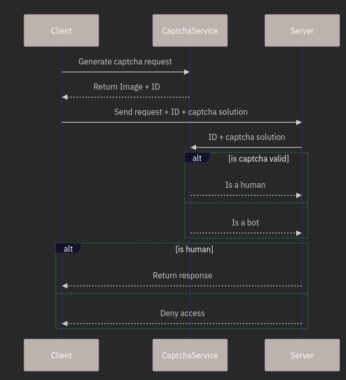

# Captcha Service

## Goal and Motivation

A captcha service helps protect web resources from bots and automated scripts. It ensures that only humans can solve the challenge.
It can help protect critical routes such as login and signup to prevent automated actions from bots and scripts. These services aren't foolproof, but provide protection against most bots. A dedicated bot can still crack this protection by employing means such as OCR and machine learning.
The goal of this project is to build a simple, easy to deploy captcha service, that can be used in other larger applications. For this project, Image based captcha with distorted alphabets and numbers is used.


# How to run?


## Without docker

```sh
$ git clone https://github.com/ananthvk/captcha-service
$ cd captcha-service
$ cp .dev.env .env
$ npm install --dev
$ npm run start:dev
```

To run the example site (at [http://localhost:3001](http://localhost:3001)),

```sh
$ cd example
$ npm run start
```

To view the docs, visit [http://localhost:3000/docs](http://localhost:3000/docs)


A screenshot of the example site to show how the generated captcha looks


Note: Storing captcha id/solution to redis has not yet been implemented, for now all captchas are stored in memory (in a Map), so this can cause memory overflow if the captchas are not deleted

# Requirements

## Functional Requirements

1. For the client - To be able to generate a new captcha using the API (`POST /generate`). The response should contain an image and an ID.
2. For the server - To be able to verify the captcha using the API (`POST /verify`). The server provides the captcha solution, and the captcha ID. The response indicates success of failure.

## Non Functional Requirements

1. Scalable - The captcha service should be horizontally scalable, and should manage lots of captcha generation and verification requests.
2. Security - The captcha service should verify that the captcha, and it's response is sent by the same client. It should also ensure that the captcha is not already used.
3. Performance - The captcha service should be performant, and should use lightweight short lived caches
4. Prevent re usability - Each captcha is one time use only, and should expire after some time.

# Architecture

A typical flow of using the captcha service



# Tech Stack

This project will use NodeJS, with Nest.js and typescript for handling captcha generation and validation. It will also use Redis as a cache, to store already verified captcha. node-canvas will be used to generate the distorted text as the challenge.

Captcha IDs and solutions will be stored in Redis, along with other client details such as user agent, ip address, etc with a short TTL. (5 minutes)

# Design

The client gets a new captcha with the following request:
```
POST /generate
```
The captcha service returns a challenge (as an image), and a corresponding ID. The service also records some client information such as user agent and IP address. The client also sends the type of captcha it wants - image/audio/ something else in the future.

The server verifies the captcha with the following request:
```
POST /verify
```
The server sends the captcha solution, ID, and client information such as IP address and headers. The captcha service verifies whether the captcha is valid, and returns the following response.

If the verification succeeded,
```
{
	"status": "success"
}
```

If the verification failed,
```
{
	"status": "error",
	"errors": []
}
```

The service also returns a list of errors, that occured

```
"invalid_solution" - The solution did not match
```

```
"client_mismatch" - The captcha generation request and verification has different client details.
```

```
"invalid_id" - Invalid captcha ID
```

```
"expired" - The captcha has expired 
```

Addendum: Also implement a site-key mechanism, to identify and serve captchas to different sites.

# Expected Duration

3 days

# Additional Features That Can Be Implemented

- Generate more complex puzzles, like that of ReCaptcha
- Use machine learning to classify which requests are bots and which are not.
- Try implementing other types of Captcha such as intelligent captchas, and friendly captchas.
- Add an option to convert the challenge text to voice for visually impaired users.
- Rate limit the captcha service to prevent abuse

# Limitations

- Not secure against advanced bots that use ML to perform text detection
- May not be accessible to all users

# Tasks

- [x] Set up the backend development tools, make a simple hello world application using the chosen tech stack.
- [x] For now, `site-key` does not have any use, but include it in the requests so that functionality can be added later
- [x] Implement `/generate` endpoint, For now, return a blank image, with a predefined captcha solution
- [x] Implement `/verify` endpoint, For now, check the predefined captcha solution
- [x] Setup swagger docs
- [ ] Setup redis, try to set and clear values
- [x]  Store client details, captcha id, and solution in Redis, modify `/generate` and `/verify` endpoints to actually create the captcha
- [x] Build a simple web application to test the captcha service
- [x] Look into image generation
- [x] return the image as base64 encoded string
- [x] Add security features such as scratches, spots, different fonts, etc, to avoid OCR
- [ ] Detect if client details have changed (such as User-Agent, IP address, other parameters)
- [ ] Implement rate limiting
- [x] Implement captcha expiry, and detecting if the same captcha has been used before
